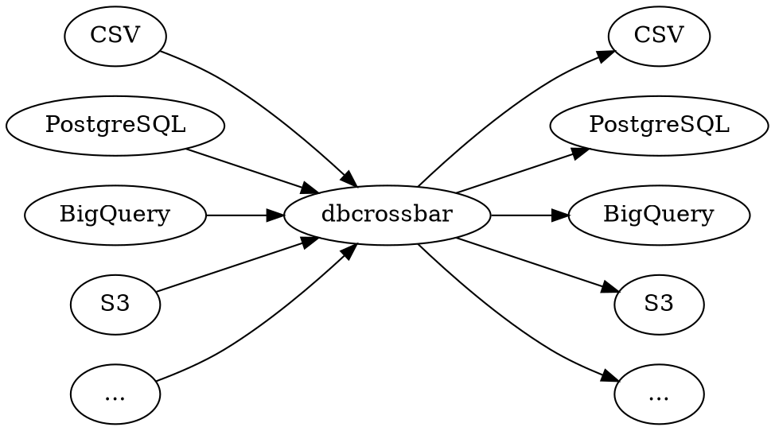
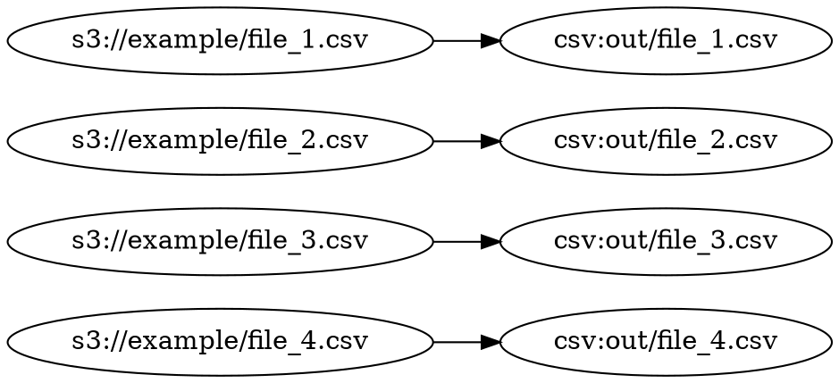
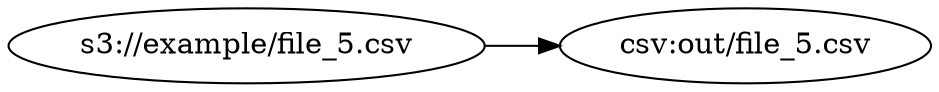

# How it works

`dbcrossbar` uses pluggable input and output drivers, allowing any input to be copied to any output:

## Parallel data streams

Internally, `dbcrossbar` uses parallel data streams. If we copy `s3://example/` to `csv:out/` using `--max-streams=4`, this will run up to 4 copies in parallel:

As soon as one stream finishes, a new one will be started:

`dbcrossbar` accomplishes this using a **stream of CSV streams.** This allows us to make extensive use of [backpressure](https://ferd.ca/queues-don-t-fix-overload.html) to control how data flows through the system, eliminating the need for temporary files. This makes it easier to work with 100GB+ CSV files and 1TB+ datasets.

## Shortcuts

When copying between certain drivers, `dbcrossbar` supports "shortcuts." For example, it can load data directly from Google Cloud Storage into BigQuery.

## Multi-threaded, asynchronous Rust

`dbcrossbar` is written using [asynchronous](https://rust-lang.github.io/async-book/) [Rust](https://www.rust-lang.org/), and it makes heavy use of a multi-threaded worker pool. Internally, it works something like a set of classic Unix pipelines running in parallel. Thanks to Rust, it bas been possible to get native performance and multithreading without spending too much time debugging.
