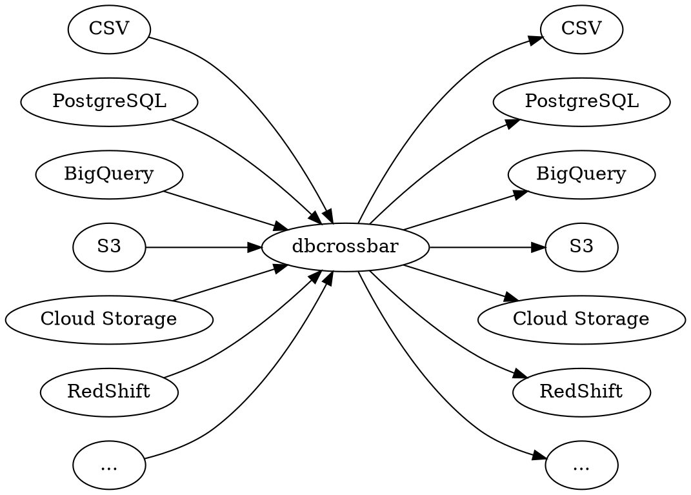

# What is `dbcrossbar`?

`dbcrossbar` is an [open source][] tool that copies large, tabular datasets between many different databases and storage formats. Data can be copied from any source to any destination.

[open source]: https://github.com/dbcrossbar/dbcrossbar



## An example

If we have a CSV file `my_table.csv` containing data:

```csv
{{#include examples/my_table.csv}}
```

And a file `my_table.sql` containing a table definition:

```sql
{{#include examples/my_table.sql}}
```

Then we can use these to create a PostgreSQL table:

```sh
{{#include examples/my_table_cp_to_postgres.sh}}
```

If we want to use the data to update a table in BigQuery, we can upsert into BigQuery using the `id` column:

```sh
{{#include examples/my_table_cp_to_bigquery.sh}}
```

Notice that we don't need to specify `--schema`, because `dbcrossbar` will automatically translate the PostgreSQL column types to corresponding BigQuery types.
